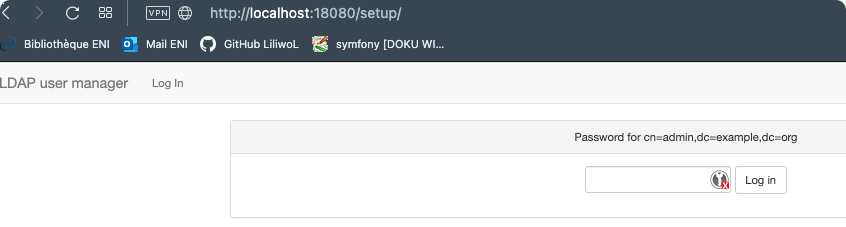
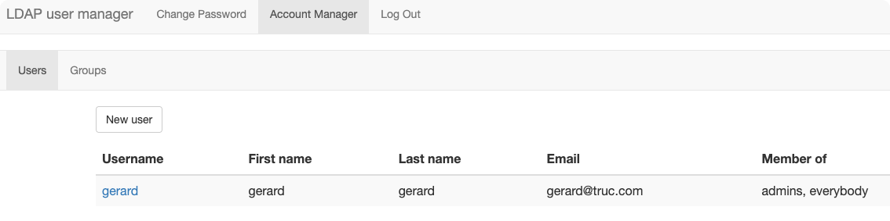

# LDAP Server

Un container Docker pour découvrir LDAP.

# Sommaire

<!-- TOC -->
* [LDAP Server](#ldap-server)
* [Sommaire](#sommaire)
* [Todo](#todo)
* [Source](#source)
* [Outils](#outils)
* [Lancement des containers](#lancement-des-containers)
* [Accès à l'inbterface de gestion graphique du serveur LDAP](#accs--linbterface-de-gestion-graphique-du-serveur-ldap)
* [Création de la base](#cration-de-la-base)
* [Connexion et gestion des utilisateurs](#connexion-et-gestion-des-utilisateurs)
* [Verify Users](#verify-users)
<!-- TOC -->

# Todo

- TPs d'installation et de configuration
- TPs de connexion (PHP ou Python)

# Source
https://blog.ruanbekker.com/blog/2022/03/20/run-openldap-with-a-ui-on-docker/

# Outils

- LDAPExplorer
  - https://ldaptool.sourceforge.net/
- JXplorer
  - http://jxplorer.org/
- Explorateur Active Directory
  - https://learn.microsoft.com/fr-fr/sysinternals/downloads/adexplorer
- LDAP Browser for Mac
  - https://www.ldapbrowsermac.com/

# Lancement des containers

Lancement des containers avec **docker-compose** ou le script fourni:
```bash
bin/start
```


# Accès à l'interface de gestion graphique du serveur LDAP

L'accès à OpenLDAP-UI se fait sur le port 18080 et les identifiants:
> User: admin
> Password: admin

Allez à l'adresse:
http://localhost:18080/setup/




Saisissez le mot de passe **admin**

Vous pourrez alors créer les utilisateurs et la base.

# Création de la base


Les vérifications sont faites sur le serveur, et les **OU** sont créées.


Vous arrivez ensuite sur l'interface pour créer des utilisateurs.


Attention, vous devez respecter une politique de mot de passe définie.


Allez jusqu'à la création réussie.


# Connexion et gestion des utilisateurs

Connectez-vous ensuite avec l'utilisateur que vous venez de créer.

Vous arrivez sur l'interface de gestion des utilisateurs.




# Verify Users

Access the openldap container:
```bash
bin/shell
ou
docker-compose exec openldap bash
```

You can use ldapsearch to verify our user:	

```bash
ldapsearch -x -h openldap -D "uid=ruan,ou=people,dc=example,dc=org" -b "ou=people,dc=example,dc=org" -w "$PASSWORD" -s base 'uid=ruan'
```

Or we can use ldapwhoami:
```bash
ldapwhoami -vvv -h ldap://openldap:389 -p 389 -D 'uid=ruan,ou=people,dc=example,dc=org' -x -w "$PASSWORD"
```

Which will provide a output with something like:
```bash
ldap_initialize( <DEFAULT> )
dn:uid=ruan,ou=people,dc=example,dc=org
Result: Success (0)
```


https://medium.com/ihme-tech/simple-docker-apache-php-authentication-with-ldap-3ac16b17bf31